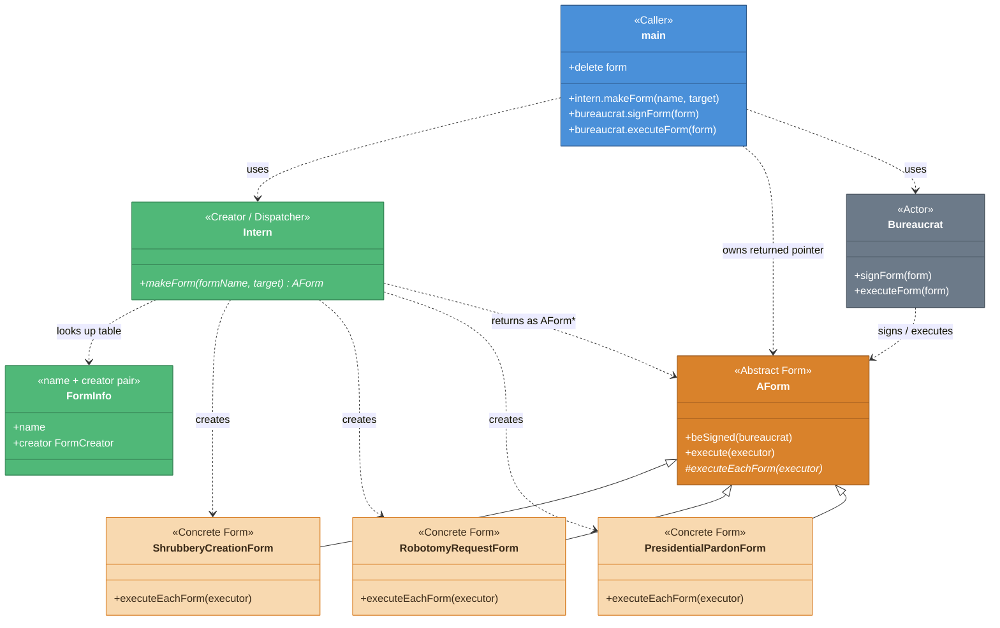

# クラス関係図 — CPP05 ex03

> 作成日: 2026-09-13  
> 用途: 学習資料（印刷用ペラ1枚）  
> 根拠: `CPP05/ex03` 実装 + `CPP05_ex03_解説.md`

> **スコープ**: クラス間の関係と、ex03 で触る主要 public API のみ。  
> private メンバ、OCF の細部、単純 getter は省略する。

---

## 【実装】ex03 クラス構造図

> 詳細設計: クラスは？関係は？

### クラス構成

| 役割 | クラス | 要点 |
| --- | --- | --- |
| 呼び出し側 | `main` | 文字列を渡し、返ってきた `AForm*` を使う |
| 生成役 | `Intern` | 名前→生成関数の表。`makeForm` だけが入口 |
| 書類（抽象） | `AForm` | 署名・実行の共通チェック。`executeEachForm` は派生 |
| 書類（具体） | 3 Form | `new` の対象。ヘッダは `Intern` が知る |
| 官僚 | `Bureaucrat` | `signForm` / `executeForm`。生成には関わらない |

### 色凡例

| 色 | 意味 |
| --- | --- |
| 🔵 青 | 呼び出し側（`main`） |
| 🟢 緑 | 生成役（`Intern` / 表） |
| 🟠 アンバー | 書類抽象（`AForm`） |
| 🟡 薄いアンバー | 書類具体（3 Form） |
| ⚫ グレー | 官僚（`Bureaucrat`） |

---

## 読み方の要点

1. **`main` は具体型を直接 `new` しない。** `Intern::makeForm` に文字列を渡す。
2. **具体型のヘッダを `#include` するのは `Intern` 側。** ビルドでは具体型のオブジェクトファイルをリンクする。具体型が消えるわけではない。
3. **生成規則（名前と生成関数の対応）は `Intern` 一箇所にまとめて書く。** 種類を足すとき、直す場所が `Intern` になる。
4. **所有権は呼び出し側。** 返ってきた `AForm*` を `delete` する。`AForm` のデストラクタが virtual である必要がある（ex02）。
