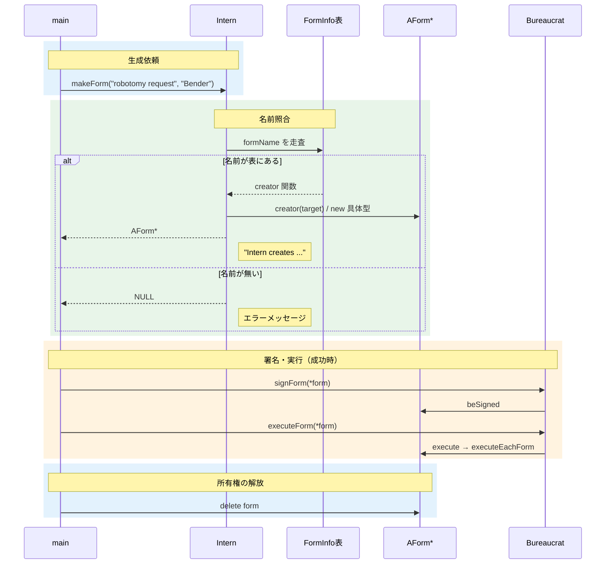
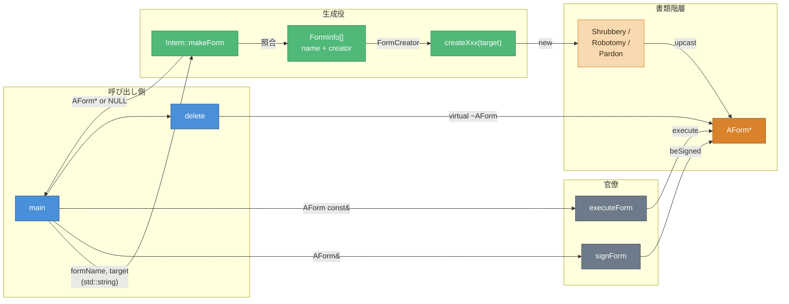

# データフロー図 — CPP05 ex03

> 作成日: 2026-09-13  
> 用途: 学習資料（印刷用ペラ1枚）  
> 根拠: `CPP05/ex03` 実装 + `CPP05_ex03_解説.md`

---

## 【設計】書類生成〜実行シーケンス

> 時間軸: いつ、何が起きるか  
> 文字列 → 表照合 → `new` → 署名・実行 → `delete`

---

## 【設計】書類生成フロー（概念）

> 接続: 何が、どこに渡されるか

---

## 主要データ型

| 境界 | データ型 | 内容 |
| --- | --- | --- |
| `main` → `Intern` | `std::string`, `std::string` | formName（キー）と target |
| `Intern` 内部 | `FormInfo` / `FormCreator` | 名前と `AForm*(*)(target)` の組 |
| `Intern` → `main` | `AForm*` | 成功時はヒープ上の具体型。失敗時は `NULL` |
| `main` → `Bureaucrat` | `AForm&` / `AForm const&` | 署名・実行。所有権は移さない |
| `main` → ヒープ | `delete` | 仮想デストラクタ経由で具体型を破棄 |

---

## 色凡例

| 色 | 意味 |
| --- | --- |
| 🔵 青 | 呼び出し側（`main`） |
| 🟢 緑 | 生成役（`Intern` / 表） |
| 🟠 アンバー | 書類（`AForm*` / 具体型） |
| ⚫ グレー | 官僚（署名・実行） |

---

## 読み方の要点

1. IRC の CommandDispatcher と同じ型の問題である。**文字列から処理を選ぶ。** if/else の森ではなく、表にまとめる。
2. 失敗時に `NULL` を返すなら、呼び出し側の null チェックを忘れるとクラッシュする。
3. 署名・実行は ex02 と同じ経路。ex03 が足すのは **生成の入口だけ** である。
