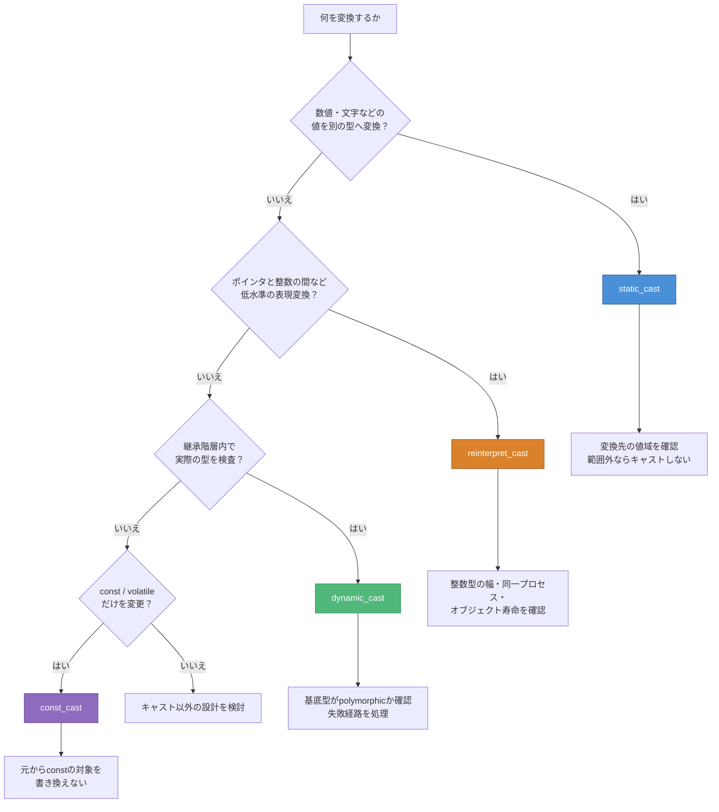

# キャスト選択図 — CPP06

> 用途: 変換の目的から、検討するキャストを選ぶ  
> 注意: キャストを選んだ後も、値域、寿命、型関係を別に確認する

## 選択フロー



## CPP06での対応

| キャスト | exercise | 対象 | キャストが保証しないこと |
| --- | --- | --- | --- |
| `static_cast` | ex00 | スカラー型間の値変換 | 範囲内か、表示可能か |
| `reinterpret_cast` | ex01 | `Data*`と`uintptr_t` | データの複製、永続化、暗号化 |
| `dynamic_cast` | ex02 | `Base*` / `Base&`から派生型 | オブジェクトの寿命、メモリ解放 |
| `const_cast` | 必須処理には不使用 | cv修飾 | 元からconstの対象を書き換える権利 |

## 区別する用語

```text
promotion
└─ 標準変換の一部。例: char → int、float → double

upcast
└─ 派生ポインタ・参照 → 公開基底ポインタ・参照

downcast
└─ 基底ポインタ・参照 → 派生ポインタ・参照
   実際の型が不明なら dynamic_cast で検査する

object slicing
└─ 派生オブジェクトを基底オブジェクトの値へコピーし、
   派生部分がコピー先に含まれない現象
```

ポインタまたは参照のupcastではobject slicingは起きない。
