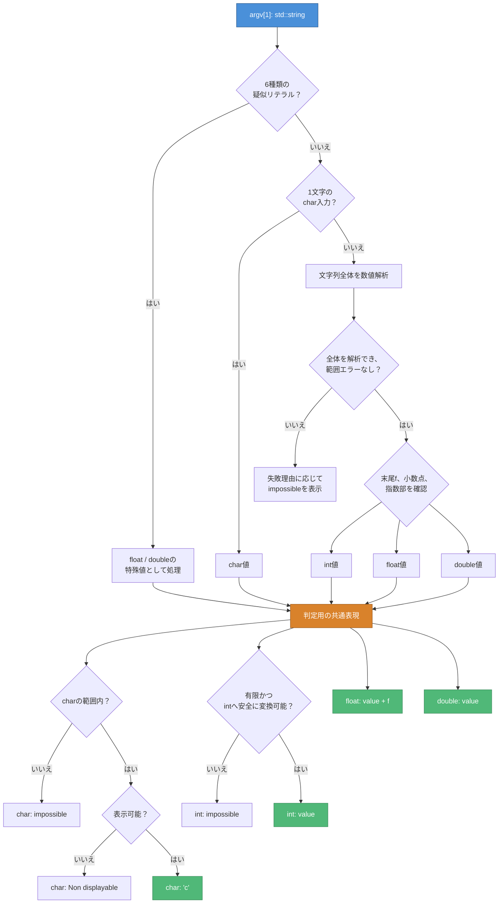

# 変換フロー図 — CPP06 ex00

> 入力文字列の分類から、4種類の表示までの処理順序を示す。  
> キャスト前の値域確認を省略しない。

## 全体フロー



## 各段階の責務

| 段階 | 入力 | 出力 | 失敗条件 |
| --- | --- | --- | --- |
| 分類 | 文字列 | char / int / float / double / special | どの形式にも一致しない |
| 解析 | 文字列 | 分類した型の値 | 全体を解析できない、範囲エラー |
| 変換可否 | 値 | 各型で表示可能か | NaN、無限大、値域外 |
| 表示 | 値と可否 | 課題指定の4行 | `.0`、`f`、文言の不一致 |

## `char`だけ二つの失敗表示がある

```text
数値としてcharへ変換できない
└─ char: impossible

charへ変換できるが印字できない
└─ char: Non displayable
```

`std::isprint`へは`static_cast<unsigned char>(character)`を渡す。
