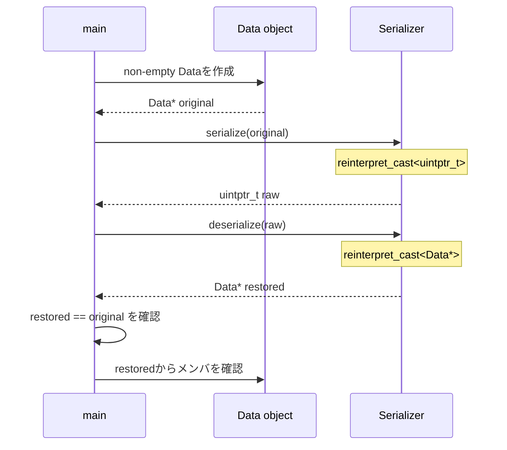
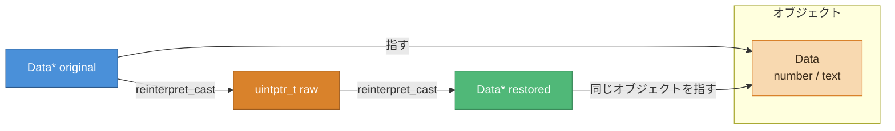

# データフロー図 — CPP06 ex01

> `Data*`を整数へ変換し、同じポインタ値へ戻す流れを示す。

## 往復シーケンス



## データとポインタ値を分ける



`raw`が保持するのはポインタ値である。`Data`のメンバは`raw`の中へコピーされない。

## 保証が成立する範囲

```text
正しい往復:
生存中のData* → 十分な大きさの整数型 → 元と同じData*

保証されない使い方:
任意の整数 → Data* → 参照
破棄済みData* → 整数 → Data* → 参照
別プロセスへ整数を送信 → Data*として復元
```

戻ったポインタを使う時点まで、元の`Data`オブジェクトを生存させる。
