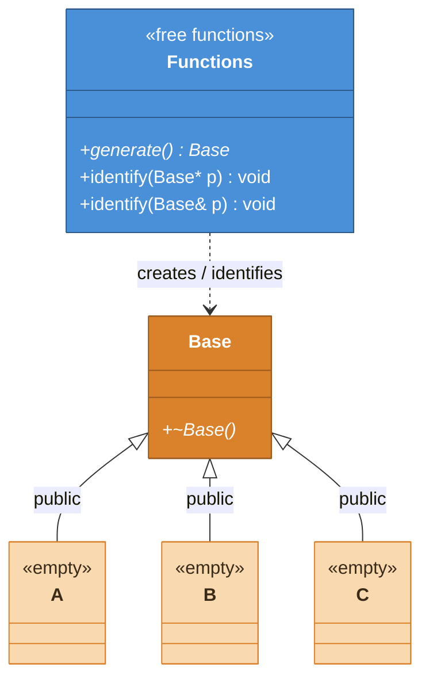

# クラス関係図 — CPP06 ex02

> スコープ: `Base`、`A`、`B`、`C`の継承関係と、課題指定の関数

## クラス構造

`*`は仮想関数を示す。`Base`のpublic仮想デストラクタによって、`Base`はポリモーフィック型になる。

## 静的型と動的型

upcast後も、動的型Bのオブジェクトは変化しない。`Base*`という式から利用できるインターフェースがBaseに限定される。

## デストラクタの二つの役割

1. `Base*`を通して`delete`したとき、実際の派生型から破棄する
2. `Base`をポリモーフィック型にし、実行時検査付き`dynamic_cast`を使えるようにする

`A`、`B`、`C`は空でよい。型が異なること自体を判別に使う。
