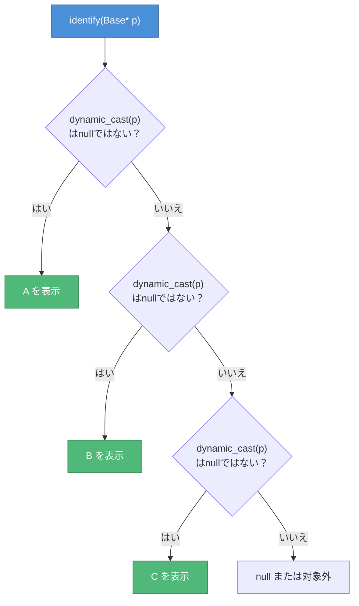
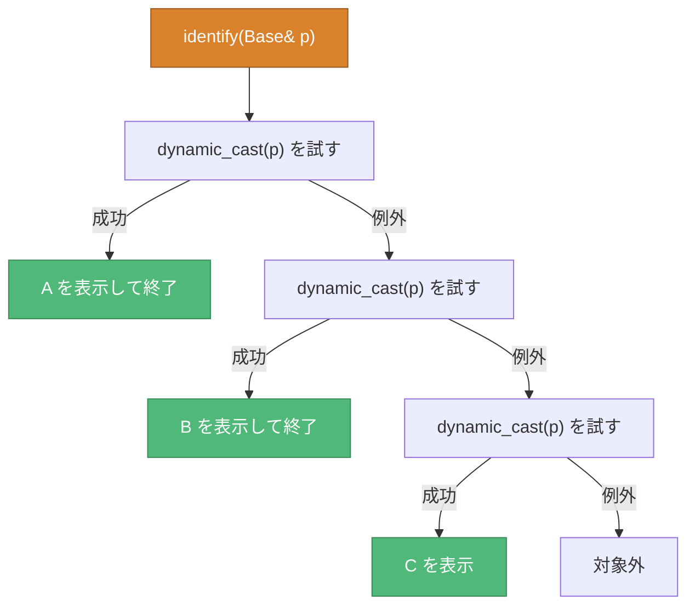
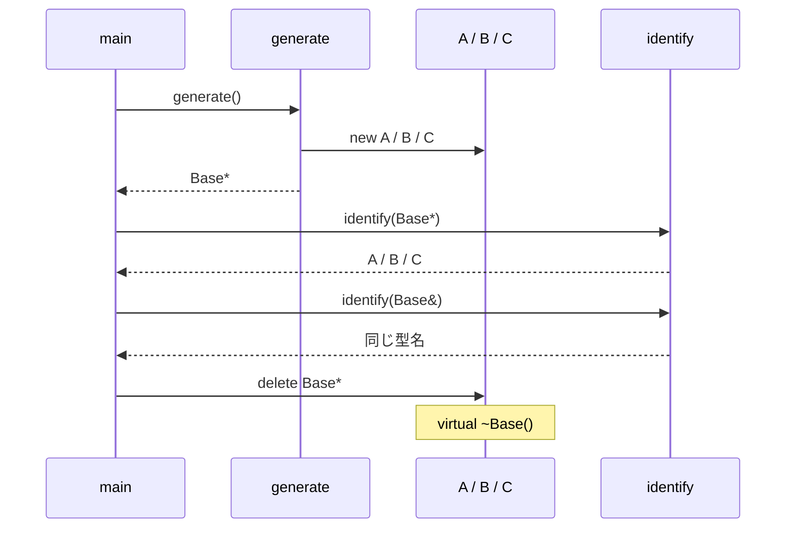

# 実型判別フロー — CPP06 ex02

> ポインタ版と参照版では、`dynamic_cast`失敗時の挙動が異なる。

## ポインタ版



ポインタへのキャストは、失敗時にnullポインタを返す。

## 参照版



参照へのキャストはnullを返せない。失敗時には`std::bad_cast`に一致する例外を送出する。

## 課題の禁止事項

```text
identify(Base& p)
    └─ identify(&p)  ← ポインタを使うため不可
```

参照版の関数内では、参照への`dynamic_cast`を使う。`<typeinfo>`はインクルードしない。

## generateから削除まで


